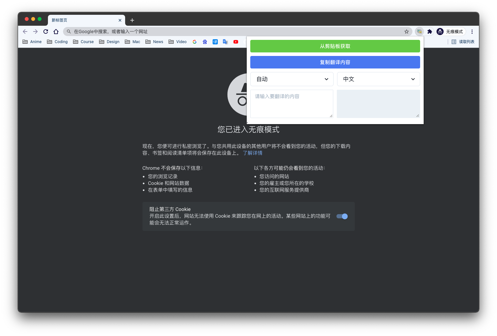

Qran
=====

一个翻译插件，个人学习Chrome插件开发的Demo项目。


## 1 准备工作

在[百度翻译开放平台](https://api.fanyi.baidu.com/)申请AppID和密钥，并在`src/useTranslator.ts`中进行相应修改。

## 2 技术栈

- Typescript
- React

## 3 安装依赖

```
yarn
```

## 4 构建


### 生产模式
```
yarn build
```

### 开发模式

```
yarn watch
```

加载`dist`文件夹即可进行调试。

## 6 屏幕截图



## 7 功能

- 从剪贴板获取要翻译的内容
- 源语言自动识别
- 实时翻译
- ......

## 8 Todo

- [ ] 提高实时翻译的准确性
- [ ] 支持更多语言
- [ ] 优化插件性能
- [ ] 发布到Chrome商店

## 9 参考

1. 脚手架：[chrome-extension-typescript-starter](https://github.com/chibat/chrome-extension-typescript-starter)

2. [百度翻译开放平台API文档](https://api.fanyi.baidu.com/doc/21)

